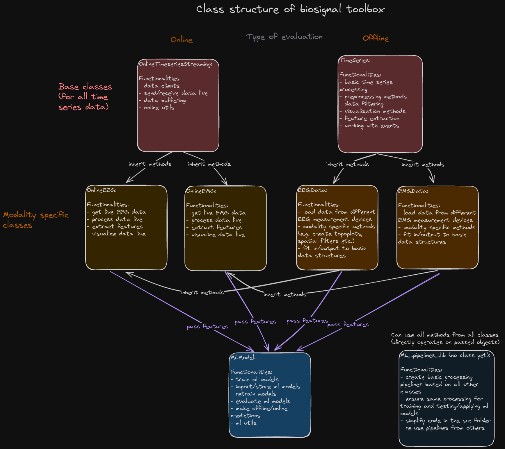

# Biosignal_toolbox

## General remarks

### Project structure
This project contains all files for biosignal analysis (especially EMG and EEG) as well as machine learning flows in python. The src folder contains all the source files and includes project folders for a specific analysis or evaluation. You can find basic examples for biosignal processing and classification in the examples folder (under src). The lib folder contains the libraries containing methods for data processing for the biosignals. In the docs folder, the documentation (html files) are provided with a description of all the implemented classes and methods. 
Single scripts or jupyter notebooks can be directly pushed to this repository. If you work on a project or evaluation containing more than one file, please create a new folder for the multiple files. If you created a machine learning flow, please consider structuring the evaluation in seperate files (e.g. loading, preprocessing, train_model, prediction). The library ist tested and used under Python 3.9.17. 
This repository should **ONLY** contain python scripts and no datasets, plots or other file formats. For the storage of data that should be analysed or evaluated, a data folder should be created containing all the files from experiments. The data folder will be ignored when adding and commiting the changes you made. If you are new to git, please have a look at the git documentation (https://www.git-scm.com/doc). 

### Installation 
To install the biosignal toolbox move to the **lib** folder run the following command to install the Python package: **pip install -e .** When using Visual Studio Code (VSC), please make sure to load the hole biosignal_toolbox repository as a project folder. Otherwise the installed python packages might not be found or detected properly by VSC.  

### Intended use and writing new methods
The biosignal toolbox includes useful classes for the processing of data and should be extended by implementing new methods in the library files (_lib.py) in the lib folder as well as example scripts of working files in the src folder. The purpose of the toolbox is to extend, customize and create high level functionalities based on existing libraries like numpy, scipy and especially mne. Each class should (by now) have full compatibility to mne, to enable to use all existing methods based of the package but also enable the possibility to write own processing and other methods to make the data analysis, recording and visualization as easy as possible. Therefore, it is required to always update corresponding mne objects and the internal variables of the individual classes of the biosignal toolbox (e.g. changed mne_raw object --> update internal variables, changed internal variables (like epoched data), update mne_epochs object). Please also make sure that every new written method only has one specific job and is as minimalistic as possible to enable maximum reusability of the code. Also, please have a look at methods that are already implemented to avoid any duplications (see docu for example). Furthermore, pay attention to write proper comments in your code (in english) to allow others to understand and adapt your implementations. 

### Data Structure 
The methods of the biosignal toolbox are mainly based on the typical MNE classes such as Raw and Epochs as well as internal data structures. The internal data structures of the toolbox are "raw data", "epoched data" and "windowed data". Each of them is represented as a numpy array with the following shapes: 
- **raw data:** numpy array with shape: (n_channels, n_sampels)  
- **epoched data:** numpy array with shape: (n_trials, n_channels, n_sampels)  
- **windowed data:** numpy array with shape: (n_trials, n_channels, n_sampels, n_windows)  

When writing new methods for the toolbox it is of great importance to consider these data structures and their shape. Guidelines and examples for writing new implementations will follow soon.  

### Coding Conventions
This section describes the general coding guidelines to follow during development process.
- **Programming Language**  
In this project, Python is used as the primary programming language.
- **Documentation**  
For the purpose of better readability and re-usability, it is essential that every script, attribute or method be well documented. In this project, the Numpy Style Python Docstrings should be used (see other example in the classes) 
- **Defining a class**  
A new class in python requires a class name. Please use Pascal case (MyNewClass) for this purpose.
- **Defining a function or method**  
Please use Camel case (myFunc) for this purpose.
- **Declaring a variable or attribute**  
Please use Snake case (new_var) for this purpose.

## src: Files and folders

### EEGNet_LRP_detection 
This folder contains all files for the prediction of movement intentions by using the EEGNet architecture (CNN-Net approach). Neural network librarys like tensorflow and keras as well as the mne library for loading and processing of EEG-data are used. The machine learning flow is currently not up to date ! (TO BE UPDATED) 

### Neural_Network_Movement_Predictions_EEG
This folder contains neural networks for preprocessing and classification based on an MLP net (own development) and CNN nets like the EEGNet from lawhern et. al. 

#### evaluation
This folder contains source files for the evaluation of the trained neural networks for the prediction of movement intentions from EEG data. 
#### live 
This folder contains several source files for the online classification of EEG data using LSL as a data streaming source. Each of the file contains a user parameter section at the top of the scripts in which the paramters can and should be changed depending on the users needs (i.e. you have to change the proj_path depending on you installation folder). Please also make sure you created a data folder besides the lib and src folder (as described above) where the data and trained models will be stored. Furthermore an LSL stream (server) has to be up and running to receive the streamed data for recording and classification (e.g. for Brainproduct LiveAmp use LSLConnector software: https://github.com/brain-products/LSL-LiveAmp/releases). You can also send recorded data via LSL for a pseudo online evaluation. 

The folder contains the following scripts that can be run for example in the following order. 

-  **record_data_LSL.py:** Run this script for the recording of EEG data from an LSL stream (as LSL client). By parsing the argument -n _filename_ you can specify the filename under which the recorded data is stored in the data folder. The data will be stored in the numpy binary format (.npy files). The key "s" on the keyboard is used to start the recording and "e" (maybe hold the button if not directly stopping) to stop the recording.   
Note: Make sure that all markers are send properly when recording via the LSL-connector software from Brainproducts. You can test this by printing the last EEG channel (markers if checkbox EEG channels is checked in connector software for triggers) in the recording script or using the _print_marker_recorded_data.py_ script to evaluate if markers were received in a test recording.  

- **train_network_models_live.py:** Run this script to train both neural network models on the recorded LSL data (specified in train_file_LSL). The models will be evaluated (validation set) on the specified amount of trials (epochs) that are excluded from the training set. By default the trained models will be saved in the data folder to be loaded for the online classification.  

- **online_EEG_prediction_LSL_exo.py:** Run this script to perform the online EEG classification by triggering the recupera exosceleton to move. This script depends on the pyrock package that has to be installed in order to use this script. 

- **online_data_viz.py:** Run this script for the visualization of the streamed EEG data as well as the probabilities (prediction outcomes) of the neural network models. 

- **convert_numpy_LSL_data_to_brainvision.py:** This script can be used to convert the recorded files from LSL stream in numpy format to the Brainvision format. 

- **online_EEG_prediction_LSL_orthosis.py** Run this script to perform an online EEG prediction to trigger the active orthosis (v2) _--> script not finished yet _

- **pseudo_online_EEG_prediction.py:** Run this script to perform a pseudo online classification by receiving data from LSL (as in real online) that is send by an LSL server (e.g. a script or even a real source). The script only outputs print statements based on markers and the classification output about the current action but does not trigger a real robotic device. 

- **send_data_LSL.py:** Run this script to send (recorded) data via LSL as an LSL server. It can be used to test the online classification in an pseudo online fashion. 

- **print_marker_recorded_data.py:** Run this script to print the events (markers) recorded in a stored numpy array that was recorded from an LSL-stream. 

### Fcn_LRP_detection (not up to date)
This folder contains the implementation of a fully connected neural network that is used for the classification of movement intentions based on the LRP and MRCPs. The model is implemented in keras and several methods for data processing and classification are integrated in the eeg library. 

### Multimodal_EEG_labelling (not up to date)
This folder contains scripts for the generation of EEG labels based on different modalities like motion tracking data (Qualisys), audio data or EMG signals. 

### EEG_denoising
The scripts in EEG denoising contain methods to reduce the noise and artifacts in the EEG data. Currently only scripts for testing autoencoders to reduce the noise and implement filters are included. 

### Boxplots_results.py 
This Python file creates boxplots of classification results that are stored in a results folder. The boxplots are created with seaborn. 

### OnlineEMGPrediction 
This folder contains files for the online prediction of EMG data. 

## Class structure of the toolbox 

The class structure of the toolbox is visualized in the following image: 

